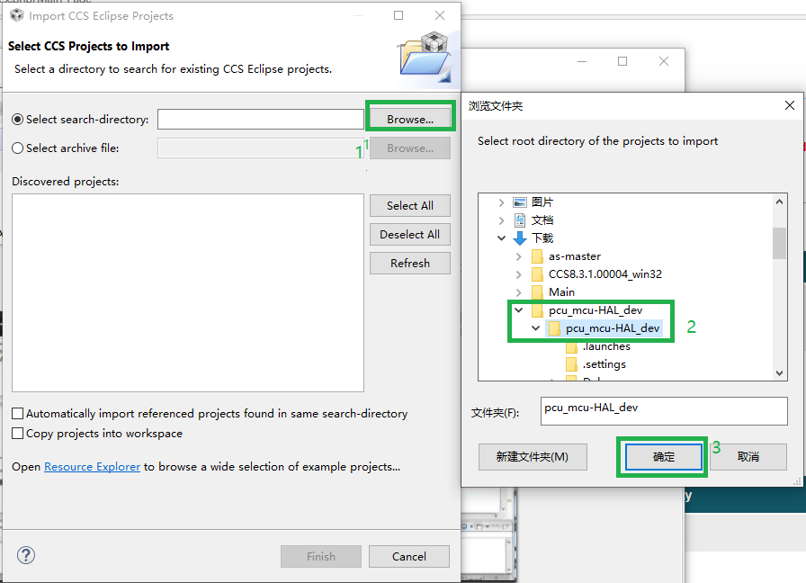

# How to flash MCU HAL

## What you will need

1. Undoubtedly a PCU board from AutoCore. The MCU model is TMS570 from TI.

2. TI XDS-class debug probe, e.g. [XDS100V3](http://dev.ti.com/tirex/explore/node?node=AEFfTlaHQHUWL-seh4M4tA__FUz-xrs__LATEST) and JTAG cable

3. A PC installed Code Composer Studio (CCS) v8.0 or above. [Download link](https://software-dl.ti.com/ccs/esd/documents/ccs_downloads.html#code-composer-studio-version-8-downloads)  
    The CCS tool supports Windows, Linux, and macOS. Details could be found on download page above.

## Build MCU HAL
> In this guide, we will use Windows 10, and CCS 8.3.1 as an example.

1. Download the source code from this repository and unzip to your.  

2. Create a working path (F:/mcu in our case) in the PC, then Run CCS8.3, input the working path into workspace.  

3. Import the downloaded source code as project.  

4. Build the project  

## Flash MCU
> In this guide, we will use TI XDS100V3 debug probe as an example.

1. Connect PCU to XDS100V3 with JTAG cable  

2. Connect XDS100V3 to PC and install the driver for it. You should be able to see it in device manager after proper installation.  

3. Power up PCU.  
    Plug in the DC power source to PCU, and then turn on the switch, you will see the LEDs on board light up.  

4. Set proper device models in CCS  

5. Select "debug" icon to build and flash. **Note**: Do not "Cancel" during erasing or loading.   

6. When successfully flashed, click "resume" button to run. The four LEDs on board (D2900,D2901,D2902,D2903) should be flashing.  

7. Turn off PCU and remove JTAG cable from it, then restart, the MCU should be working properly.  
   In case of program still not running, you could try to reset MCU using the button below:  

